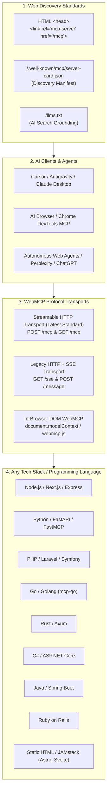

# 🌐 WebMCP: Master Implementation Guide for Any Website & Programming Language

Welcome to the definitive **WebMCP Implementation & Diagnostic Guide** for **MCP-SEO** (`io.github.sparrow84001/mcp-seo`) and the modern agentic web.

Based on official [modelcontextprotocol.io](https://modelcontextprotocol.io) specifications, **WebMCP** enables any website—regardless of backend language or frontend stack—to expose machine-readable tools, live searchable data, and agentic workflows to AI clients (ChatGPT, Claude, Cursor, Antigravity, Perplexity, Chrome DevTools AI, and Autonomous AI Browsers).

---

## 🏛️ 1. WebMCP Architecture & Official Protocol Standards



### Official MCP Transport Models:
1. **Streamable HTTP (Current Standard):**
   * Exposes a unified endpoint (e.g. `/mcp` or `/api/mcp`).
   * Supports standard HTTP `POST` requests returning JSON or request-scoped Server-Sent Event (SSE) streams.
   * Eliminates long-lived open connection overhead and scales seamlessly across serverless functions (Vercel, AWS Lambda, Cloudflare Workers).
2. **HTTP + SSE (Legacy / Compatibility Standard):**
   * `GET /sse`: Persistent Server-Sent Events stream for event pushes.
   * `POST /message?sessionId=<id>`: JSON-RPC 2.0 command channel.
3. **In-Browser DOM WebMCP (`document.modelContext` / `window.webmcp`):**
   * Standard for client-side JavaScript execution in AI-enabled browsers, allowing agents to manipulate the DOM, filter UI tables, and execute form actions directly in the user session.

---

## 🚀 2. Multi-Language Implementation Blueprints (Production Ready)

### A. Next.js (App Router - TypeScript)
**File:** `app/api/mcp/route.ts`  
**Dependencies:** `@modelcontextprotocol/sdk zod`

```typescript
import { McpServer } from '@modelcontextprotocol/sdk/server/mcp.js';
import { StreamableHTTPServerTransport } from '@modelcontextprotocol/sdk/server/streamableHttp.js';
import { z } from 'zod';

const server = new McpServer({
  name: 'nextjs-web-mcp',
  version: '1.0.0'
});

// Register site tools
server.registerTool(
  'search_site_content',
  {
    description: 'Search articles, documentation, products, and services.',
    inputSchema: { query: z.string().describe('Search query keyword') }
  },
  async ({ query }) => {
    // Query database, CMS, or vector store
    return {
      content: [{ type: 'text', text: `Search results for "${query}" on my site.` }]
    };
  }
);

export const dynamic = 'force-dynamic';

export async function POST(req: Request) {
  const transport = new StreamableHTTPServerTransport({
    sessionIdGenerator: () => crypto.randomUUID()
  });
  await server.connect(transport);
  return transport.handleRequest(req);
}

export async function GET(req: Request) {
  const transport = new StreamableHTTPServerTransport({
    sessionIdGenerator: () => crypto.randomUUID()
  });
  await server.connect(transport);
  return transport.handleRequest(req);
}
```

---

### B. Python (FastAPI / Starlette / FastMCP)
**File:** `mcp_server.py`  
**Dependencies:** `fastapi uvicorn mcp`

```python
from fastapi import FastAPI, Request
from fastapi.middleware.cors import CORSMiddleware
from mcp.server.fastmcp import FastMCP

# Initialize FastMCP Server
mcp = FastMCP("python-web-mcp")

@mcp.tool()
def search_catalog(query: str) -> str:
    """Search products, inventory, and documentation."""
    return f"Python WebMCP Search Results for: {query}"

# Initialize FastAPI App
app = FastAPI(title="WebMCP Endpoint")

app.add_middleware(
    CORSMiddleware,
    allow_origins=["*"],
    allow_credentials=True,
    allow_methods=["*"],
    allow_headers=["*"],
    expose_headers=["mcp-session-id", "x-session-id"]
)

# Mount MCP ASGI App to /mcp
app.mount("/mcp", mcp.streamable_http_app())

if __name__ == "__main__":
    import uvicorn
    uvicorn.run(app, host="0.0.0.0", port=8000)
```

---

### C. PHP (Laravel 10 / 11 / 12)
**File:** `app/Http/Controllers/McpController.php` & `routes/api.php`

```php
<?php

namespace App\Http\Controllers;

use Illuminate\Http\Request;
use Symfony\Component\HttpFoundation\StreamedResponse;

class McpController extends Controller
{
    public function handle(Request $request)
    {
        $payload = $request->json()->all();
        $method = $payload['method'] ?? '';
        $id = $payload['id'] ?? null;

        // Handle JSON-RPC initialization
        if ($method === 'initialize') {
            return response()->json([
                'jsonrpc' => '2.0',
                'id' => $id,
                'result' => [
                    'protocolVersion' => '2024-11-05',
                    'serverInfo' => ['name' => 'laravel-web-mcp', 'version' => '1.0.0'],
                    'capabilities' => ['tools' => new \stdClass()]
                ]
            ]);
        }

        // List Tools
        if ($method === 'tools/list') {
            return response()->json([
                'jsonrpc' => '2.0',
                'id' => $id,
                'result' => [
                    'tools' => [
                        [
                            'name' => 'search_database',
                            'description' => 'Query site database and articles via Eloquent',
                            'inputSchema' => [
                                'type' => 'object',
                                'properties' => ['keyword' => ['type' => 'string']],
                                'required' => ['keyword']
                            ]
                        ]
                    ]
                ]
            ]);
        }

        // Call Tool
        if ($method === 'tools/call') {
            $toolName = $payload['params']['name'] ?? '';
            $args = $payload['params']['arguments'] ?? [];
            return response()->json([
                'jsonrpc' => '2.0',
                'id' => $id,
                'result' => [
                    'content' => [
                        ['type' => 'text', 'text' => "Laravel MCP tool output for: " . json_encode($args)]
                    ]
                ]
            ]);
        }

        return response()->json(['jsonrpc' => '2.0', 'id' => $id, 'error' => ['code' => -32601, 'message' => 'Method not found']]);
    }
}
```
**Route:** `routes/api.php`
```php
Route::any('/mcp', [App\Http\Controllers\McpController::class, 'handle']);
```

---

### D. Go (Golang)
**Dependencies:** `github.com/mark3labs/mcp-go/server`

```go
package main

import (
	"context"
	"net/http"

	"github.com/mark3labs/mcp-go/mcp"
	"github.com/mark3labs/mcp-go/server"
)

func main() {
	s := server.NewMCPServer("go-web-mcp", "1.0.0")

	// Register Tool
	tool := mcp.NewTool("search_site",
		mcp.WithDescription("Search site catalog and articles"),
		mcp.WithString("query", mcp.Required(), mcp.Description("Search keyword")),
	)

	s.AddTool(tool, func(ctx context.Context, request mcp.CallToolRequest) (*mcp.CallToolResult, error) {
		query, _ := request.Params.Arguments["query"].(string)
		return mcp.NewToolResultText("Go MCP Results for: " + query), nil
	})

	// Streamable HTTP Handler
	httpServer := server.NewStreamableHTTPServer(s)
	http.Handle("/mcp", httpServer)
	http.ListenAndServe(":8080", nil)
}
```

---

### E. Rust (Axum / Tokio)
**Dependencies:** `axum tokio serde_json`

```rust
use axum::{routing::post, Json, Router};
use serde_json::{json, Value};
use std::net::SocketAddr;

async fn mcp_handler(Json(payload): Json<Value>) -> Json<Value> {
    let method = payload.get("method").and_then(|m| m.as_str()).unwrap_or("");
    let id = payload.get("id").cloned().unwrap_or(json!(null));

    match method {
        "initialize" => Json(json!({
            "jsonrpc": "2.0",
            "id": id,
            "result": {
                "protocolVersion": "2024-11-05",
                "serverInfo": { "name": "rust-web-mcp", "version": "1.0.0" },
                "capabilities": { "tools": {} }
            }
        })),
        "tools/list" => Json(json!({
            "jsonrpc": "2.0",
            "id": id,
            "result": {
                "tools": [{
                    "name": "rust_fast_search",
                    "description": "Blazing fast Rust in-memory index search",
                    "inputSchema": {
                        "type": "object",
                        "properties": { "query": { "type": "string" } },
                        "required": ["query"]
                    }
                }]
            }
        })),
        _ => Json(json!({
            "jsonrpc": "2.0",
            "id": id,
            "error": { "code": -32601, "message": "Method not found" }
        }))
    }
}

#[tokio::main]
async fn main() {
    let app = Router::new().route("/mcp", post(mcp_handler));
    let addr = SocketAddr::from(([0, 0, 0, 0], 8080));
    axum::Server::bind(&addr).serve(app.into_make_service()).await.unwrap();
}
```

---

### F. C# / ASP.NET Core (.NET 8/9 Minimal APIs)
```csharp
var builder = WebApplication.CreateBuilder(args);
builder.Services.AddCors(options => {
    options.AddPolicy("AllowAll", p => p.AllowAnyOrigin().AllowAnyMethod().AllowAnyHeader());
});

var app = builder.Build();
app.UseCors("AllowAll");

app.MapPost("/mcp", async (HttpContext context) => {
    using var reader = new StreamReader(context.Request.Body);
    var json = await reader.ReadToEndAsync();
    var doc = System.Text.Json.JsonDocument.Parse(json);
    var method = doc.RootElement.GetProperty("method").GetString();
    var id = doc.RootElement.GetProperty("id");

    if (method == "initialize") {
        return Results.Json(new {
            jsonrpc = "2.0",
            id = id,
            result = new {
                protocolVersion = "2024-11-05",
                serverInfo = new { name = "dotnet-web-mcp", version = "1.0.0" },
                capabilities = new { tools = new { } }
            }
        });
    }

    if (method == "tools/list") {
        return Results.Json(new {
            jsonrpc = "2.0",
            id = id,
            result = new {
                tools = new[] {
                    new {
                        name = "dotnet_query",
                        description = "Query ASP.NET EntityFramework DB",
                        inputSchema = new { type = "object", properties = new { q = new { type = "string" } } }
                    }
                }
            }
        });
    }

    return Results.Json(new { jsonrpc = "2.0", id = id, error = new { code = -32601, message = "Method not found" } });
});

app.Run();
```

---

### G. Java / Spring Boot 3
```java
@RestController
@CrossOrigin(origins = "*", exposedHeaders = {"mcp-session-id", "x-session-id"})
public class McpController {

    @PostMapping(value = "/mcp", consumes = MediaType.APPLICATION_JSON_VALUE, produces = MediaType.APPLICATION_JSON_VALUE)
    public Map<String, Object> handleMcp(@RequestBody Map<String, Object> payload) {
        String method = (String) payload.get("method");
        Object id = payload.get("id");

        if ("initialize".equals(method)) {
            return Map.of(
                "jsonrpc", "2.0",
                "id", id,
                "result", Map.of(
                    "protocolVersion", "2024-11-05",
                    "serverInfo", Map.of("name", "spring-boot-mcp", "version", "1.0.0"),
                    "capabilities", Map.of("tools", Map.of())
                )
            );
        }

        if ("tools/list".equals(method)) {
            return Map.of(
                "jsonrpc", "2.0",
                "id", id,
                "result", Map.of(
                    "tools", List.of(
                        Map.of(
                            "name", "spring_jpa_search",
                            "description", "Search JPA repositories",
                            "inputSchema", Map.of("type", "object")
                        )
                    )
                )
            );
        }

        return Map.of("jsonrpc", "2.0", "id", id, "error", Map.of("code", -32601, "message", "Method not found"));
    }
}
```

---

### H. Ruby on Rails
```ruby
# app/controllers/mcp_controller.rb
class McpController < ApplicationController
  skip_before_action :verify_authenticity_token

  def handle
    payload = JSON.parse(request.body.read)
    method = payload["method"]
    id = payload["id"]

    case method
    when "initialize"
      render json: {
        jsonrpc: "2.0",
        id: id,
        result: {
          protocolVersion: "2024-11-05",
          serverInfo: { name: "rails-web-mcp", version: "1.0.0" },
          capabilities: { tools: {} }
        }
      }
    when "tools/list"
      render json: {
        jsonrpc: "2.0",
        id: id,
        result: {
          tools: [{
            name: "rails_activerecord_query",
            description: "Query Rails ActiveRecord models",
            inputSchema: { type: "object" }
          }]
        }
      }
    else
      render json: { jsonrpc: "2.0", id: id, error: { code: -32601, message: "Method not found" } }
    end
  end
end
```

---

### I. Static HTML / Client-Side DOM WebMCP
```html
<script>
window.webmcp = {
  version: "1.0.0",
  tools: [
    {
      name: "highlight_pricing_tier",
      description: "Highlights the recommended pricing tier plan on the page.",
      parameters: { planName: "string" },
      execute: function(args) {
        document.querySelectorAll('.tier-card').forEach(el => el.classList.remove('highlight'));
        const target = document.querySelector(`.tier-card[data-plan="${args.planName}"]`);
        if (target) {
          target.classList.add('highlight');
          target.scrollIntoView({ behavior: 'smooth' });
          return { success: true, message: `Highlighted ${args.planName}` };
        }
        return { success: false, message: "Plan not found" };
      }
    }
  ]
};
</script>
```
