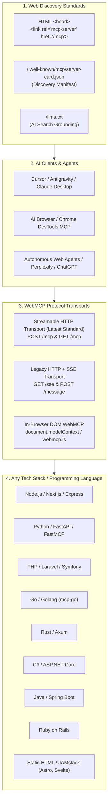

# 🌐 WebMCP: Master Implementation Guide for Any Website & Programming Language

Welcome to the definitive **WebMCP Implementation & Diagnostic Guide** for **MCP-SEO** (`io.github.sparrow84001/mcp-seo`) and the modern agentic web.

Based on official [modelcontextprotocol.io](https://modelcontextprotocol.io) specifications, **WebMCP** enables any website—regardless of backend language or frontend stack—to expose machine-readable tools, live searchable data, and agentic workflows to AI clients (ChatGPT, Claude, Cursor, Antigravity, Perplexity, Chrome DevTools AI, and Autonomous AI Browsers).

---

## 🏛️ 1. WebMCP Architecture & Official Protocol Standards



### Official MCP Transport Models:
1. **Streamable HTTP (Current Standard):**
   * Exposes a unified endpoint (e.g. `/mcp` or `/api/mcp`).
   * Supports standard HTTP `POST` requests returning JSON or request-scoped Server-Sent Event (SSE) streams.
   * Eliminates long-lived open connection overhead and scales seamlessly across serverless functions (Vercel, AWS Lambda, Cloudflare Workers).
2. **HTTP + SSE (Legacy / Compatibility Standard):**
   * `GET /sse`: Persistent Server-Sent Events stream for event pushes.
   * `POST /message?sessionId=<id>`: JSON-RPC 2.0 command channel.
3. **In-Browser DOM WebMCP (`document.modelContext` / `window.webmcp`):**
   * Standard for client-side JavaScript execution in AI-enabled browsers, allowing agents to manipulate the DOM, filter UI tables, and execute form actions directly in the user session.

---

## 🚀 2. Multi-Language Implementation Blueprints (Production Ready)

### A. Next.js (App Router - TypeScript)
**File:** `app/api/mcp/route.ts`  
**Dependencies:** `@modelcontextprotocol/sdk zod`

```typescript
import { McpServer } from '@modelcontextprotocol/sdk/server/mcp.js';
import { StreamableHTTPServerTransport } from '@modelcontextprotocol/sdk/server/streamableHttp.js';
import { z } from 'zod';

const server = new McpServer({
  name: 'nextjs-web-mcp',
  version: '1.0.0'
});

// Register site tools
server.registerTool(
  'search_site_content',
  {
    description: 'Search articles, documentation, products, and services.',
    inputSchema: { query: z.string().describe('Search query keyword') }
  },
  async ({ query }) => {
    // Query database, CMS, or vector store
    return {
      content: [{ type: 'text', text: `Search results for "${query}" on my site.` }]
    };
  }
);

export const dynamic = 'force-dynamic';

export async function POST(req: Request) {
  const transport = new StreamableHTTPServerTransport({
    sessionIdGenerator: () => crypto.randomUUID()
  });
  await server.connect(transport);
  return transport.handleRequest(req);
}

export async function GET(req: Request) {
  const transport = new StreamableHTTPServerTransport();
  await server.connect(transport);
  return transport.handleRequest(req);
}
```

---

### B. Python (FastAPI & FastMCP)
**File:** `app/mcp_server.py`  
**Dependencies:** `pip install "mcp[cli]" fastapi uvicorn`

```python
from fastapi import FastAPI
from fastapi.middleware.cors import CORSMiddleware
from mcp.server.fastmcp import FastMCP

mcp = FastMCP("python-web-mcp")

@mcp.tool()
def search_catalog(keyword: str) -> str:
    """Search inventory catalogue for live pricing and stock status."""
    return f"Inventory results for '{keyword}': Available in stock."

@mcp.tool()
def get_contact_info() -> dict:
    """Get official contact methods and support availability."""
    return {
        "email": "support@example.com",
        "phone": "+1-800-555-0199",
        "hours": "9am - 6pm EST"
    }

if __name__ == "__main__":
    # Start FastMCP server with Streamable HTTP transport
    mcp.run(transport="streamable-http", port=8000)
```

---

### C. PHP / Laravel (10, 11, 12)
**File:** `app/Http/Controllers/McpController.php`  
**Route:** `Route::match(['get', 'post', 'options'], '/api/mcp', [McpController::class, 'handle']);`

```php
<?php
namespace App\Http\Controllers;

use Illuminate\Http\Request;

class McpController extends Controller
{
    public function serverCard()
    {
        return response()->json([
            'serverInfo' => ['name' => 'laravel-web-mcp', 'version' => '1.0.0'],
            'transport' => 'streamable-http',
            'endpoints' => ['mcp' => '/api/mcp']
        ])->header('Access-Control-Allow-Origin', '*');
    }

    public function handle(Request $request)
    {
        if ($request->isMethod('OPTIONS')) {
            return response('', 200)
                ->header('Access-Control-Allow-Origin', '*')
                ->header('Access-Control-Allow-Methods', 'GET, POST, OPTIONS')
                ->header('Access-Control-Allow-Headers', 'Content-Type, Authorization, mcp-session-id')
                ->header('Access-Control-Expose-Headers', 'mcp-session-id');
        }

        $payload = $request->json()->all();
        $method = $payload['method'] ?? '';
        $id = $payload['id'] ?? null;

        if ($method === 'tools/list') {
            return response()->json([
                'jsonrpc' => '2.0',
                'id' => $id,
                'result' => [
                    'tools' => [
                        [
                            'name' => 'search_laravel_catalog',
                            'description' => 'Search products and articles in Laravel Eloquent models.',
                            'inputSchema' => [
                                'type' => 'object',
                                'properties' => ['keyword' => ['type' => 'string']],
                                'required' => ['keyword']
                            ]
                        ]
                    ]
                ]
            ])->header('Access-Control-Allow-Origin', '*')
              ->header('Access-Control-Expose-Headers', 'mcp-session-id');
        }

        if ($method === 'tools/call') {
            $toolName = $payload['params']['name'] ?? '';
            $keyword = $payload['params']['arguments']['keyword'] ?? '';
            return response()->json([
                'jsonrpc' => '2.0',
                'id' => $id,
                'result' => [
                    'content' => [
                        ['type' => 'text', 'text' => "Laravel found items matching '{$keyword}'."]
                    ]
                ]
            ])->header('Access-Control-Allow-Origin', '*');
        }

        return response()->json([
            'jsonrpc' => '2.0',
            'id' => $id,
            'error' => ['code' => -32601, 'message' => 'Method not found']
        ], 404)->header('Access-Control-Allow-Origin', '*');
    }
}
```

---

### D. Go (Golang)
**File:** `main.go`  
**Dependencies:** `go get github.com/mark3labs/mcp-go`

```go
package main

import (
	"context"
	"fmt"
	"net/http"
	"github.com/mark3labs/mcp-go/mcp"
	"github.com/mark3labs/mcp-go/server"
)

func main() {
	s := server.NewMCPServer("golang-web-mcp", "1.0.0", server.WithToolCapabilities(true))

	tool := mcp.NewTool("search_inventory",
		mcp.WithDescription("Search live inventory items."),
		mcp.WithString("keyword", mcp.Required(), mcp.Description("Search keyword")),
	)

	s.AddTool(tool, func(ctx context.Context, req mcp.CallToolRequest) (*mcp.CallToolResult, error) {
		keyword, _ := req.Params.Arguments["keyword"].(string)
		return mcp.NewToolResultText(fmt.Sprintf("Go inventory match: %s", keyword)), nil
	})

	sseServer := server.NewSSEServer(s, "http://localhost:8080")
	http.Handle("/sse", sseServer.HandleSSE())
	http.Handle("/message", sseServer.HandleMessage())

	fmt.Println("🚀 Go WebMCP Server running on :8080")
	http.ListenAndServe(":8080", nil)
}
```

---

### E. Rust (Axum)
**File:** `src/main.rs`  
**Dependencies:** `axum tokio serde serde_json`

```rust
use axum::{routing::{get, post}, Json, Router};
use serde_json::{json, Value};
use std::net::SocketAddr;

#[tokio::main]
async fn main() {
    let app = Router::new()
        .route("/mcp", post(handle_mcp))
        .route("/.well-known/mcp/server-card.json", get(server_card));

    let addr = SocketAddr::from(([0, 0, 0, 0], 3000));
    println!("🦀 Rust WebMCP Server running on {}", addr);
    let listener = tokio::net::TcpListener::bind(addr).await.unwrap();
    axum::serve(listener, app).await.unwrap();
}

async fn server_card() -> Json<Value> {
    Json(json!({
        "serverInfo": { "name": "rust-web-mcp", "version": "1.0.0" },
        "transport": "streamable-http",
        "endpoints": { "mcp": "/mcp" }
    }))
}

async fn handle_mcp(Json(payload): Json<Value>) -> Json<Value> {
    let method = payload.get("method").and_then(Value::as_str).unwrap_or("");
    let id = payload.get("id").cloned().unwrap_or(Value::Null);

    if method == "tools/list" {
        return Json(json!({
            "jsonrpc": "2.0",
            "id": id,
            "result": {
                "tools": [{
                    "name": "lookup_rust_data",
                    "description": "High performance Rust backend tool.",
                    "inputSchema": { "type": "object" }
                }]
            }
        }));
    }
    Json(json!({ "jsonrpc": "2.0", "id": id, "error": { "code": -32601, "message": "Method not found" } }))
}
```

---

### F. Client-Side In-Browser DOM WebMCP & Static JAMstack (Astro, Svelte, Hugo, HTML)
**File:** `public/webmcp.js` (or in `<head>`):

```html
<link rel="mcp-server" href="/mcp" />
<script>
(function() {
  if (typeof window === 'undefined') return;

  window.modelContext = window.modelContext || {
    tools: [],
    registerTool: function(toolDef) {
      this.tools.push(toolDef);
      console.log('[WebMCP] Registered in-browser tool:', toolDef.name);
    }
  };

  // Register client-side browser interactive tool
  window.modelContext.registerTool({
    name: 'filter_catalog_ui',
    description: 'Filter catalogue items and update DOM in real-time without page reload.',
    parameters: {
      type: 'object',
      properties: {
        keyword: { type: 'string', description: 'Keyword to search on the page' }
      },
      required: ['keyword']
    },
    execute: async function(args) {
      const searchBox = document.querySelector('input[type="search"], input[name="q"]');
      if (searchBox) {
        searchBox.value = args.keyword;
        searchBox.dispatchEvent(new Event('input', { bubbles: true }));
        return { status: 'success', message: 'Filter applied for: ' + args.keyword };
      }
      return { status: 'error', message: 'Search box element not found' };
    }
  });
})();
</script>
```

---

## 📡 3. Discovery Standards & Grounding

To ensure AI search engines and agents automatically discover your WebMCP server:

### 1. `/.well-known/mcp/server-card.json`
Place in your `public/` folder:
```json
{
  "serverInfo": {
    "name": "my-site-mcp",
    "version": "1.0.0",
    "description": "Live tool and search API for AI browsing agents."
  },
  "authentication": {
    "required": false
  },
  "transport": "streamable-http",
  "endpoints": {
    "mcp": "/mcp",
    "sse": "/sse"
  },
  "tools": [
    {
      "name": "search_site_content",
      "description": "Search articles, documentation, products, and services.",
      "inputSchema": {
        "type": "object",
        "properties": {
          "query": { "type": "string", "description": "Search keyword" }
        },
        "required": ["query"]
      }
    }
  ]
}
```

### 2. HTML Discovery Tag
In your `<head>` section:
```html
<link rel="mcp-server" href="/mcp" />
```

### 3. `/llms.txt`
In `public/llms.txt`:
```markdown
# My Website

> Official documentation, products, and services.

## WebMCP AI Agent Endpoints
* MCP Streamable HTTP: `/mcp`
* Discovery Manifest: `/.well-known/mcp/server-card.json`
* Protocol: https://modelcontextprotocol.io/docs/transports/streamable-http
```

---

## 🩺 4. Common Problems, Diagnostic Checklist & Fixes

| Problem / Failure Mode | Diagnostic Indicator | Why It Happens | Exact Fix |
| :--- | :--- | :--- | :--- |
| **CORS Blocked** | Browser console error: `No Access-Control-Allow-Origin` | AI agent running in a browser environment cannot reach endpoint. | Set `Access-Control-Allow-Origin: *` and expose `mcp-session-id`. |
| **DNS Rebinding Attack Risk** | Warning on public endpoints | Local endpoints vulnerable to unauthorized origin requests. | Validate `Origin` header to match allowed domains. |
| **Missing Discovery Link** | AI crawlers fail to find tools | No `<link rel="mcp-server">` in HTML `<head>`. | Run `seo_generate_code_fix` with `addWebMcpDiscovery: true`. |
| **JSON-RPC Schema Error** | Error code `-32600` or `-32602` | Arguments sent do not match the declared `inputSchema`. | Use `zod` or JSON-Schema validator to validate request parameters. |
| **Broken SSE Keepalive** | Connection drops after 30-60s | Reverse proxy (Cloudflare, Nginx) terminates idle HTTP connections. | Send comment keepalive ping (`:\n\n` or `event: ping`) every 15-30 seconds. |

---

## 🧪 5. Testing & Verification

Run the automated verification tool anytime:
```json
{
  "tool": "seo_test_web_mcp",
  "arguments": {
    "url": "https://your-website.com",
    "targetLanguage": "typescript-node"
  }
}
```
Or run the interactive prompt in chat:
> *"Audit WebMCP support and generate implementation fixes using `webmcp_implementation_and_fix`."*

